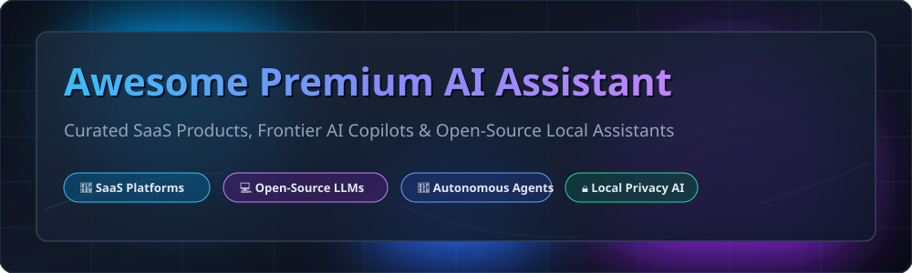

# 🤖 Awesome Premium AI Assistant

## 📌 Top Premium AI Assistant & Copilot Ecosystem

> **A curated showcase of commercial SaaS AI platforms and open-source GitHub projects specializing in Large Language Models (LLM), AI Assistants, Autonomous Coding Agents, and Local Privacy-First AI.**

**Last updated: October 2026**

---

## 🔍 Overview & Market Analysis

This repository tracks notable **commercial AI assistant platforms** and **open-source projects** providing conversational AI, code generation, autonomous web search, deep research, and workspace productivity.

### 📊 SaaS Sector Market Dynamics
> The global AI Assistant and Copilot market is estimated at **$28.5 Billion in 2026** and projected to exceed **$140 Billion by 2030**. The commercial SaaS sector is **highly concentrated** among frontier model providers and major tech conglomerates (Microsoft, Google, OpenAI, Anthropic). It exhibits strong **winner-take-all dynamics** driven by multi-billion dollar compute infrastructure, proprietary model capabilities, and deep enterprise workflow integration.

---

## 📑 Table of Contents

- [🚀 SaaS & Hosted AI Platforms](#-saas--hosted-ai-platforms)
- [💻 Open-Source GitHub Projects](#-open-source-github-projects)
- [🤝 How to Contribute](#-how-to-contribute)
- [⚠️ Disclaimer](#%EF%B8%8F-disclaimer)
- [⭐ Star History](#-star-history)
- [💖 Support & Community](#-support--community)

---

## 🚀 SaaS & Hosted AI Platforms

Below is the curated list of leading commercial AI assistant SaaS platforms, **sorted by Company Size (Valuation / Revenue) descending**:

| Product / Company | Core Focus & Features | Starting Price | Free Tier / Free Trial Limits | Company Size (Valuation / Revenue) |
| :--- | :--- | :--- | :--- | :--- |
| **[Microsoft Copilot Pro](https://www.microsoft.com/microsoft-365/copilot)** | Deepest Microsoft 365 integration across Word, Excel, PowerPoint, Outlook & Teams | `$20.00/month` | Free Tier: Unlimited web access with limited daily GPT-4o chat turns & 15 image boosts/day | **$3.3 Trillion Valuation**   *(~$245B Revenue)* |
| **[Gemini Advanced](https://gemini.google.com/)** | Google's premier AI with 1M token context window, Deep Research & Workspace integration | `$19.99/month` | Free Tier: Unlimited standard Gemini model queries + 2-month trial for Gemini Advanced | **$2.2 Trillion Valuation**   *(~$307B Revenue)* |
| **[ChatGPT Plus](https://openai.com/chatgpt/pricing/)** | Industry reference standard AI assistant with GPT-4o, DALL-E 3, Data Analysis & Custom GPTs | `$20.00/month` | Free Tier: Unlimited GPT-4o mini access + limited GPT-4o messages (resets every 3h) | **$157 Billion Valuation**   *(~$3.7B ARR)* |
| **[Claude Pro](https://claude.ai/)** | Preferred choice for developers and writers with Claude 3.5/4 Sonnet, 200K token context & Artifacts | `$20.00/month` | Free Tier: ~30-40 messages per 8 hours with Claude 3.5 Sonnet based on demand | **$40 Billion Valuation**   *(~$1B ARR)* |
| **[Grok SuperGrok](https://x.ai/)** | xAI reasoning assistant with real-time X (Twitter) search synthesis & fast multimodal generation | `$30.00/month` | Free Tier: 10 Grok-2 queries per 2 hours & 20 image generation requests per day on X | **$24 Billion Valuation**   *(~$100M ARR)* |
| **[Perplexity Pro](https://www.perplexity.ai/pro)** | Premier AI search engine featuring real-time web citations, Deep Research & multi-model access | `$20.00/month` | Free Tier: 5 Pro web searches per 4 hours + unlimited standard search queries | **$9 Billion Valuation**   *(~$50M ARR)* |
| **[Jasper AI](https://www.jasper.ai/)** | Marketing-centric AI assistant with brand voice, automated campaign generation & SEO optimization | `$39.00/month` | Free Trial: 7-day full feature trial with 10,000 word credits limit | **$1.5 Billion Valuation**   *(~$85M Revenue)* |
| **[Poe Subscriptions](https://poe.com/)** | Quora's multi-model aggregator granting unified access to ChatGPT, Claude, Gemini & custom bots | `$19.99/month` | Free Tier: 3,000 daily compute points to query standard AI bots | **$500 Million Valuation**   *(~$30M Revenue)* |
| **[Copy.ai](https://www.copy.ai/)** | AI copywriter & GTM workflow automation engine for sales and marketing teams | `$49.00/month` | Free Tier: 2,000 word generation limit per month forever (1 user seat) | **$250 Million Valuation**   *(~$15M Revenue)* |
| **[Writesonic](https://writesonic.com/)** | Content generation suite, long-form AI article writer, SEO optimizer & customer service chatbots | `$16.00/month` | Free Tier: 25 one-time generation credits upon account registration | **$100 Million Valuation**   *(~$10M Revenue)* |

---

## 💻 Open-Source GitHub Projects

The open-source AI assistant landscape provides sovereign interfaces, self-hosted RAG solutions, and local model engines. Below is the list of top open-source repositories **sorted by Stars_Count descending**:

1. **[Ollama](https://github.com/ollama/ollama)**   
   **The standard command-line engine for running local LLMs.** Supports Llama 3, Mistral, Gemma, and Phi with single-command deployment (`ollama run llama3.2`). Serves as the backend for Open WebUI, Jan, and LibreChat.

2. **[Open WebUI](https://github.com/open-webui/open-webui)**   
   **The leading feature-complete self-hosted ChatGPT alternative.** MIT licensed. Features built-in RAG, document parsing, web search synthesis, image generation, multi-user role management, and complete offline capability with Ollama.

3. **[ChatGPT-Next-Web](https://github.com/ChatGPTNextWeb/ChatGPT-Next-Web)**   
   **Lightweight, cross-platform Web UI for ChatGPT and LLMs.** One-click deployment on Vercel with web search, prompt templates, and multi-provider support.

4. **[GPT4All](https://github.com/nomic-ai/gpt4all)**   
   **Privacy-first desktop ecosystem for local LLM execution.** Run LLMs locally on consumer hardware without GPU requirements using CPU quantized models and LocalDocs indexing.

5. **[Dify](https://github.com/langgenius/dify)**   
   **Open-source LLM application development platform.** Combines AI workflow orchestration, RAG engine, prompt management, and agentic assistant builders.

6. **[Open Interpreter](https://github.com/OpenInterpreter/open-interpreter)**   
   **Natural language code execution environment in your terminal.** Allows local LLMs to write and execute Python, JavaScript, Shell scripts, and control your computer locally.

7. **[Lobe Chat](https://github.com/lobehub/lobe-chat)**   
   **Modern, open-source AI chat framework with plugin ecosystem.** Beautiful UI supporting TTS, multi-modal vision models, custom agent marketplace, and self-hosting.

8. **[AnythingLLM](https://github.com/Mintplex-Labs/anything-llm)**   
   **Document-centric enterprise AI assistant with RAG built-in.** Turn any document, website, or PDF into an interactive chat workspace with strict multi-user access control.

9. **[Flowise](https://github.com/FlowiseAI/Flowise)**   
   **Drag & drop UI node builder for LangChain and AI Agents.** Easily build conversational assistants, RAG pipelines, and automated LLM workflows.

10. **[Jan](https://github.com/janhq/jan)**   
    **Offline, privacy-first desktop AI assistant.** AGPL-3.0 licensed. Operates completely offline on Windows, Mac, and Linux with native hardware acceleration (NVIDIA, Apple Silicon).

11. **[OpenHands (formerly OpenDevin)](https://github.com/All-Hands-AI/OpenHands)**   
    **Autonomous open-source AI software engineer agent.** Capable of editing codebases, executing terminal commands, browsing technical docs, and resolving GitHub issues in Docker sandboxes.

12. **[LibreChat](https://github.com/danny-avila/LibreChat)**   
    **Polished multi-provider ChatGPT clone.** Supports OpenAI, Anthropic, Google Gemini, Ollama, and local endpoints with conversation branching, Artifacts, and Code Interpreter.

13. **[LocalAI](https://github.com/mudler/LocalAI)**   
    **Drop-in OpenAI REST API replacement for local inference.** Serves LLMs, image generation, audio transcription, and embeddings locally without GPU dependencies.

14. **[Continue](https://github.com/continuedev/continue)**   
    **Open-source AI coding assistant for VS Code and JetBrains.** Connect any model (commercial or local via Ollama) for inline code completion, refactoring, and terminal chat.

15. **[Aider](https://github.com/Aider-AI/aider)**   
    **Command-line AI pair programmer.** Edits multi-file codebases in local git repositories and automatically commits changes with descriptive commit messages.

16. **[Perplexica](https://github.com/ItzCrazyKns/Perplexica)**   
    **Open-source AI search engine alternative to Perplexity.** Uses SearxNG for privacy-focused web search indexing and local LLMs for deep answer synthesis.

17. **[Khoj](https://github.com/khoj-ai/khoj)**   
    **Open-source personal AI assistant.** Search and chat with your personal notes, documents, and internet research via desktop, web, or Obsidian integration.

18. **[Morphic](https://github.com/miurla/morphic)**   
    **AI-powered generative search engine.** Delivers interactive search responses with inline citations, charts, and media cards.

---

## 🤝 How to Contribute

We welcome community contributions! Follow these steps to submit additions or updates:

1. **Fork** the repository.
2. Edit `README.md` to add your platform or open-source tool.
3. Follow the standardized table or list structure (include tool name, website/GitHub URL, pricing/stars, and features).
4. Submit a **Pull Request** with a concise summary of the addition.

---

## ⚠️ Disclaimer

- This repository is a **community-curated index** for informational and educational purposes.
- **Privacy & Security**: Always check data handling policies. Commercial SaaS platforms may use conversation inputs for model training, whereas local open-source tools retain data strictly on your machine.
- **Frontier vs Local Models**: Commercial frontier models (GPT-4o, Claude 3.5/4 Sonnet, Gemini Ultra) lead in complex reasoning and massive contexts. Open-source stacks provide sovereign interfaces and agent frameworks powered by local engines (Llama 3, Mistral, Gemma).

---

## ⭐ Star History

---

## 💖 Support & Community

Thank you for exploring **Awesome-Premium-AI-Assistant**! If you find this curated ecosystem helpful, please consider supporting the project:

- ⭐ **Star** this repository to show your support!
- 🍴 **Fork** and contribute your favorite AI tools or improvements.
- 📢 **Share** with developers, researchers, and AI enthusiasts.
- ☕ **Buy me a coffee / Sponsor**: Support ongoing maintenance on [GitHub Sponsors Dashboard](https://github.com/sponsors/ishandutta2007).

---

*Made with ❤️ for developers, researchers, and organizations seeking AI assistant sovereignty.*
